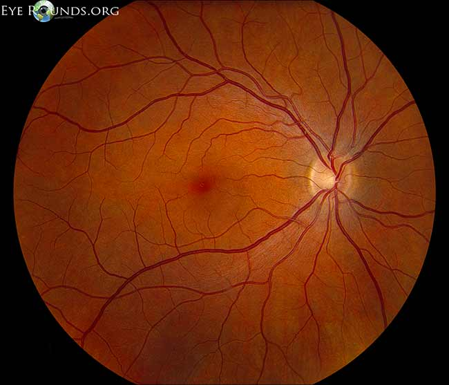
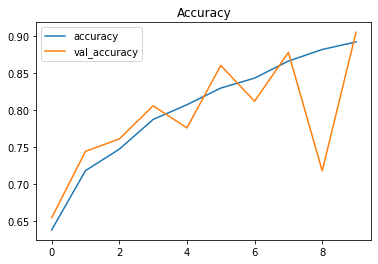
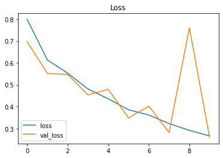

# Diabetic-Retinopathy
Detecting Diabetic Retinopathy using Image Processing and Deep Learning Techniques

## Link For New Dataset 
```
File Size :- 9.8 GB
Total Number of Images :- 10,800
```

DRIVE LINK FOR OLD DATASET - https://drive.google.com/drive/folders/1thyBgcyp_Jy2Rkk7658AaMTTaCgxYbs0?usp=sharing <br>
DRIVE LINK FOR GAUSSIAN FILTERED DATASET - https://drive.google.com/drive/folders/1t9DqBPYHBYWirhm6q-2aj1_jqyhJV9NB?usp=sharing <br>
PLEASE CROP A NORMAL DATASET INTO A 224*224 SIZE IMAGE WHILE PROCESSING THE IMAGES USING THE GAUSSIAN FILTER! <br>

# DETECTING DIABETIC RETINOPATHY
### Introduction
Diabetes is a disease which occurs when the pancreas does not secrete enough insulin or the body is unable to process it properly. This disease affects the circulatory system slowly, including that of the retina. As diabetes progresses, the vision of a patient may start to deteriorate and eventually lead to diabetic retinopathy. Diabetic retinopathy (DR) is a common retinal complication associated with diabetes, caused by damage to the blood vessels in the tissue at the back of the eye (retina). It is a major cause of blindness in both middle and advanced age groups. It has four stages - Mild NPDR(Non proliferative diabetic retinopathy), Moderate NPDR, Severe NPDR and PDR.

<div>
 

</div> 

<p> Fig. Normal retina v/s retina with Diabetic Retinopathy
  

### Use case
Users can take their own fundus image using a 20D lens from the comfort of their homes, and use our automated system to upload their image and take the DR examination themselves, saving
costs, time and effort involved with visiting a ophthalmologist.

### About
The model goes through Image processing techniques for cleaning and better visualisation of optic nerves. We implemented the model on CLAHE and Gaussian filter for the purpose.
The model uses a DenseNet-121 Deep Convolutinal Neural Network architecture, trained on an augmented Messidor-2 dataset and fine-tuned after transfer learning. It provides an incompetent accuracy of 89.91%, beating the accuracy provided by its competent VGG-16. The DNN performs a multi-class classification to detect the Diabetic Retinopathy in the fundus image and classify it into one of the 5 classes mentioned above.

### RESULTS AND EVALUTATIONS

<div>
 

</div> 

<p> Fig. Training v/s Validation accuracy (Left) and Training v/s validation loss (Right) </p>


### More about this
Google Colab link for DL code - https://colab.research.google.com/drive/1B-LzeNhG39_dkUJNz4HnzkEBCmcWOmMv?usp=sharing#scrollTo=qhk1cb7Kw6ZU <br/>
Read our published research paper here - https://drive.google.com/file/d/1Ihb3HaDtckby19t18nZWQ2BuiMA79dgD/view?usp=sharing 
